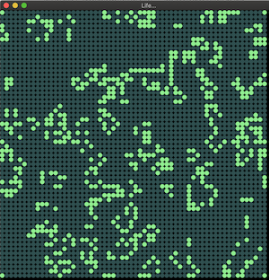

# Jeu de la vie

Plusieurs versions sont possibles; ici cette version en JavaFX est volontairement complexe avec utilisation de 2 grilles : 
- l'une pour la représentation de l'état courant
- l'autre pour l'historique de l'état précédent.

La classe principale est l'application JavaFX `application/JeuDeLaVie`

Voir les autres branches pour les autres versions..

ps. JavaFX n'est pas présent dans les distribution Java > 10. Les librairies JavaFX peuvent être téléchargées ici : 
[https://openjfx.io](https://openjfx.io)
